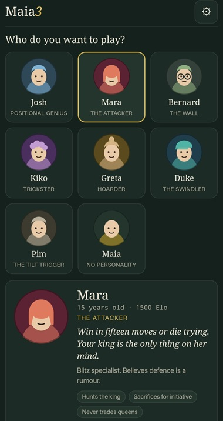
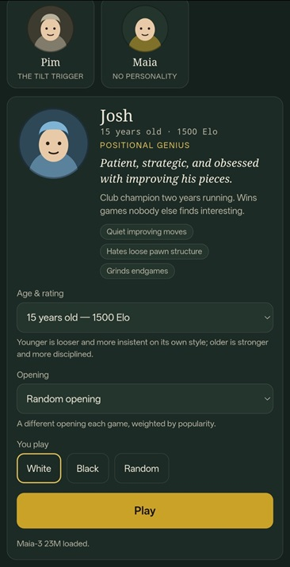
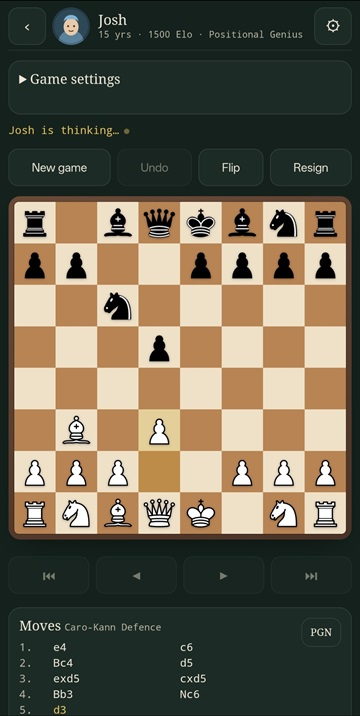
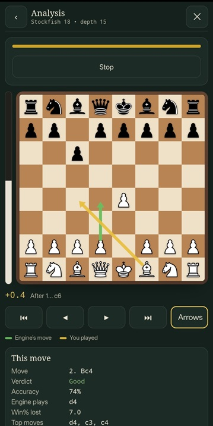
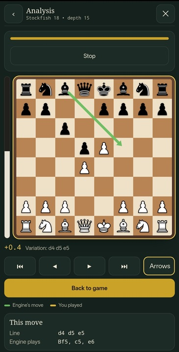

# Maia 3 — Play a Person, Not a Machine

An offline-first chess app built around **Maia-3**, with named personalities
that change how Maia chooses among its human-like candidate moves.

**Maia-3 plays. Stockfish analyzes. Personality supplies the character.**

No cloud service is required for normal play or analysis.

## What makes it different?

Instead of making seven separate chess engines, Maia 3 gives one Maia-3 model
different playing styles:

- **Positional Genius** — patient and strategic
- **The Attacker** — aggressive and initiative-focused
- **The Wall** — defensive and solid
- **Trickster** — tactical and trappy
- **Hoarder** — material-focused
- **The Swindler** — practical and dangerous when the position gets messy
- **The Tilt Trigger** — passive, persistent and annoying in exactly the right way

The personality system re-ranks Maia's plausible candidates using multiple
chess features, a soundness gate, and optional opponent/trap search. It does
not replace Maia with Stockfish.

## The four important settings

**Elo** controls the character's baseline playing strength.

**Personality** controls the style.

**Thinking budget** controls how much personality refinement can be completed
for a move. It is a maximum, not a forced delay. If refinement finishes
early, the move is played early. If there is not enough time left to complete
useful refinement, the app safely falls back to Maia's own move.

**Temperature (0.0–1.0)** controls the final move sampling:

```text
0.0 → deterministic
0.5 → moderate variety
1.0 → maximum normal sampling variety
```

Temperature **does not turn personality off**. At 0.0 the personality layer
still ranks the candidates; the final choice is simply deterministic.

The old per-personality `policy_temp` mechanism has been removed so that it
cannot secretly change the practical strength of characters at the same Elo.

## Models

The public release includes the **Maia-3 5M** model:

```text
weights/maia3-5m.bin
```

You do not need to download or add the 5M model yourself.

**5M is the recommended model for phones** and is the default model in this
release.

Larger models are optional:

```text
weights/
  maia3-5m.bin      ← included
  maia3-23m.bin     ← optional
  maia3-79m.bin     ← optional
```

For provenance/licensing information about the bundled 5M model, see
`weights/NOTICE-maia3-5m.txt`.

## Windows

This release is **portable on normal Windows 10/11 installations**.
**Python and Node.js are not required.**

1. Put the project folder anywhere on the PC.
2. Double-click **`Start Maia 3.bat`**.
3. The launcher starts the included PowerShell/.NET local web server.
4. Your browser opens `http://localhost:8000/`.

Keep the launcher window open while using Maia 3.

The server uses Windows' built-in PowerShell/.NET components. It does not
install Python, Node.js, npm, or another runtime.

The same server can make the app available to a phone on the same Wi-Fi.
Run `ipconfig`, find the PC's IPv4 address, and open:

```text
http://YOUR-PC-IP:8000/
```

on the phone.

If port 8000 is already occupied:

```text
Start Maia 3.bat 8001
```

## Phone — easiest route: PWA

For a one-time setup:

1. Start the Windows launcher.
2. Put the phone and PC on the same Wi-Fi.
3. Find the PC's IPv4 address with `ipconfig`.
4. Open `http://YOUR-PC-IP:8000/` on the phone.
5. Open **Settings → Load** and cache a model.
6. Install the page as a home-screen app.

After the app and model are cached, normal play works without Wi-Fi or mobile
data.

## Build your own Android APK with GitHub Actions

The repository already contains the workflow:

```text
.github/workflows/android.yml
```

### 1. Create the repository

Create a GitHub repository and upload the **contents of this project to the
repository root**.

The important paths must look like:

```text
.github/workflows/android.yml
android-build/
index.html
js/
css/
weights/
...
```

Do **not** put the whole project inside another `maia3-web/` directory.

### 2. Models

The repository already includes the **Maia-3 5M** model at:

```text
weights/maia3-5m.bin
```

The GitHub Actions workflow bundles the 5M model into the APK automatically.
For the normal release build, you do **not** need to add the 5M model yourself.

The 23M and 79M models are optional. Add them to `weights/` only if you want
them included in your own custom build.

Do not bundle the 79M model into normal GitHub releases unless you know how
you want to distribute large files (GitHub has a 100 MB per-file limit for
ordinary pushes).

### 3. Run the build

On GitHub:

```text
Actions
→ Build Maia3 Android APK
→ Run workflow
```

Wait for the workflow to finish.

Then open the completed workflow run and download:

```text
maia3-chess-apk
```

The artifact contains the debug APK.

### 4. Install the APK

On Android, unzip the artifact and install the `.apk`.

For the normal GitHub Actions build, the **5M model is already bundled**
and no manual model selection is required on first launch.

If you build a custom APK without bundled weights, use:

```text
Settings → Load
```

and select a Maia `.bin` model. The selected model is cached on the phone
after loading.

## Local APK build

A developer with Android tooling can build locally. The normal release path is
the GitHub Actions workflow above. For a local build, make sure the required
Stockfish 18.0.8 files are already present under the repository's `stockfish/`
directory, then run:

```bash
cd android-build
npm install
npm run prepare-www
npx cap add android
npx cap sync android
cd android
./gradlew assembleDebug
```

The APK will be under:

```text
android/app/build/outputs/apk/debug/
```

You do not need Android Studio when using the GitHub Actions route.

## Offline architecture

Normal play is local:

```text
Chess position
   ↓
Maia-3 CPU inference
   ↓
Personality candidate ranking
   ↓
Global Temperature
   ↓
Move
```

Analysis is local:

```text
Game position
   ↓
Stockfish.js
   ↓
Objective analysis
```

There is no remote move inference, no game server and no API dependency for
normal use.

On Windows, the launcher downloads the pinned Stockfish 18.0.8 analysis files
from unpkg once if they are not already present. After that first download,
analysis also works offline.

## Performance

The final implementation is deliberately **CPU-only**.

It uses Web Workers and an adaptive worker pool for independent personality
evaluations. It does not require WebGPU and does not depend on a GPU.

Personality work is more expensive than Vanilla Maia because it may evaluate
several candidate positions and, when enabled, perform bounded opponent/trap
search.

If the phone is slow:

1. use the 5M model;
2. lower the personality thinking budget;
3. disable trap search when you do not need it.

## Architecture

The important separation is:

```text
Elo          = baseline strength
Personality  = style
Time budget  = how much refinement is affordable
Temperature  = final sampling/variety
Stockfish    = objective analysis
```

Per personality move:

```text
Current position
    ↓
Maia-3 root inference
    ↓
Maia candidate moves
    ↓
candidate features + value checks
    ↓
personality scoring
    ↓
soundness gate
    ↓
optional bounded trap/opponent search
    ↓
final ranking
    ↓
global Temperature
    ↓
move
```

Maia's own move is held as a safe fallback from the beginning. A worker crash,
timeout, cancellation, or exhausted budget can therefore never freeze the
game.

## Analysis

Stockfish 18 is used only for analysis.

The graph is based on actual position evaluations:

```text
position
→ Stockfish evaluation
→ move
→ resulting position
→ Stockfish evaluation
```

The displayed graph is not cumulative move loss.

Move classification and accuracy are separate calculations.

Variations use the same Stockfish evaluator and never automatically play the
engine's reply.

See `stockfish/README.md` and `android-build/README-ANDROID.md` for the
packaging-specific details.

## Testing

The repository includes regression tests for:

- engine loading and recovery
- personality behavior
- character presets
- openings
- analysis
- variation history
- Android packaging
- Stockfish worker behavior
- adaptive-chunk alignment
- concurrency/recovery

There is also `selftest.html` for browser/device checks that cannot be fully
validated in Node.

Example:

```bash
node tests/engine-test.mjs
node tests/personality-test.mjs
node tests/adaptive-chunk-alignment-test.mjs
node tests/analysis-test.mjs
```

## License and third-party notices

This project contains third-party components under different licenses.

Read these before redistributing:

- `LICENSE`
- `THIRD-PARTY-NOTICES.md`
- `licenses/`

Key licenses:

| Component | License |
|---|---|
| Maia-3 | AGPL-3.0 |
| Stockfish.js 18.0.8 | GPL-3.0 |
| chess.js | BSD-2-Clause |
| Cburnett pieces | GPLv2+ |

The Maia-3 source repository is:
https://github.com/CSSLab/maia3

Stockfish.js source:
https://github.com/nmrugg/stockfish.js

chess.js source:
https://github.com/jhlywa/chess.js

Cburnett attribution/source:
https://github.com/lichess-org/lila

Keep the license and notice files with redistributed source/builds.

## Project layout

```text
.github/workflows/android.yml   GitHub APK build
android-build/                  Capacitor packaging
css/                            UI
js/                             application + Maia + personality + analysis
licenses/                       third-party license texts/notices
stockfish/                     Stockfish packaging/license info
tests/                          regression tests
weights/                        bundled 5M model + optional larger .bin files
index.html                      web app entry point
Start Maia 3.bat               Windows launcher
selftest.html                  browser/device self-test
```

## A note about the models

The application does not convert weights in the browser.

It expects the already-converted Maia-3 `.bin` container files.

The official Maia-3 repository is the source for the model family and
inference architecture. See its repository and license before redistributing
model weights.

---

**Maia 3 is a Maia-3 chess app with a personality layer — not a Stockfish
clone with character names.**


## Screenshots

A few screenshots from the app:

### Character selection


### Character profile


### Gameplay


### Stockfish analysis


### Analysis variation

